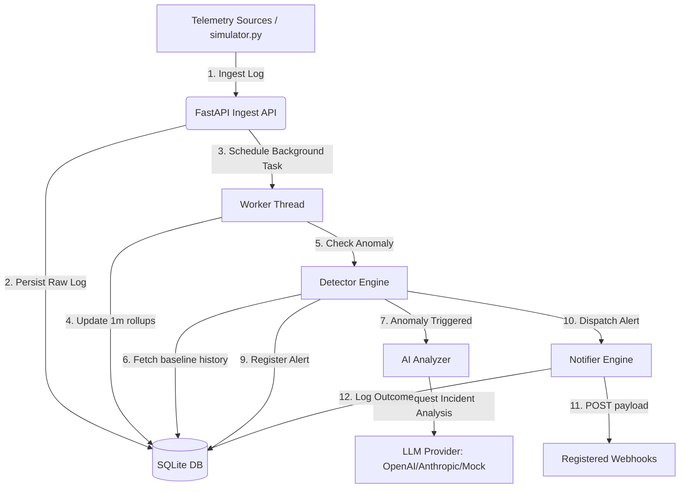

# Watchtower AI: Intelligent Observability & Event Watchdog

Watchtower AI is a lightweight, developer-first, and visually stunning SRE observability engine. Built with **FastAPI** and **SQLite**, it runs entirely locally, providing automated rolling-window statistical anomaly detection, AI-assisted root-cause incident analysis, and webhook alert dispatching.

The system features a premium glassmorphic dashboard built using **Tailwind CSS v3**, **Flowbite**, and **ApexCharts** to visualize live telemetry metrics, inspect active incidents, manage integration targets, and execute chaos simulations.

---

## Key Features

- 📥 **Lightweight Log Ingestion API**: A fast REST endpoint (`/api/v1/ingest`) that parses and persists raw logs, triggering real-time rollup calculations.
- 📈 **Statistical Anomaly Detection**: Tracks the moving baseline of service error rates using a Z-score calculation over a sliding window. Spikes with a Z-score greater than `3.0` trigger alerts.
- 🤖 **Configurable AI Analysis**: Performs automated root-cause analysis on statistical spikes. Fully supports **OpenAI (GPT-4o-mini)**, **Anthropic (Claude 3.5 Sonnet)**, or a detailed **heuristic-based offline mock** if no credentials are set.
- 🔗 **Asynchronous Webhook Alerts**: Automatically dispatches alerts to registered target webhooks, complete with the AI incident audit log, and registers delivery status codes.
- 🎛️ **Interactive Dashboard**: A modern, dark-mode dashboard serving metrics charts, a live log viewer, and a chaos simulator controller to force service outages and test response playbooks.
- 🧪 **Mock Sandbox Receiver**: A built-in endpoint that logs webhooks received locally and displays them in a debug pane in the UI.

---

## Project Structure

```
watchtower-ai/
├── backend/
│   ├── __init__.py
│   ├── db.py            # SQLite database engine, Base class, and session dependencies
│   ├── detector.py      # Statistical Z-score calculation and OpenAI/Anthropic completion API client
│   ├── main.py          # FastAPI application routes, schemas mappings, and background tasks
│   ├── models.py        # SQLAlchemy schema definitions (LogEntry, MetricRollup, Alert, Webhooks)
│   ├── notifier.py      # Webhook dispatcher handling client requests
│   ├── schemas.py       # Pydantic validation models (LogCreate, SystemSummary, AlertResponse)
│   └── worker.py        # Background task that calculates minutely rollups
├── static/
│   ├── index.html       # Single-page glassmorphic dashboard using Tailwind CSS and Flowbite
│   └── app.js           # Dashboard chart updates, CRUD webhooks, and live logging polling
├── tests/
│   └── test_watchtower.py # Comprehensive unit test suite running against in-memory DB
├── .env.example         # System configuration variables template
├── .gitignore           # Python, virtualenv, and SQLite database git exclusion rules
├── prompts.md           # Turn-by-turn prompt execution audit log
├── requirements.txt     # Python project dependencies
└── README.md            # System overview and deployment documentation
```

---

## System Architecture



---

## Environment Variables Configuration

The application is configured using a `.env` file at the root of the project directory.

| Variable Name | Type | Required | Default | Description |
| :--- | :--- | :--- | :--- | :--- |
| `DATABASE_URL` | String | No | `sqlite:///./watchtower.db` | Connection URI for the SQLite database. |
| `LLM_PROVIDER` | String | No | `mock` | AI Provider to use: `openai`, `anthropic`, or `mock`. Defaults to `mock` if keys are missing. |
| `AI_MODEL` | String | No | Provider Specific | Model identifier to target (e.g., `gpt-4o-mini`, `claude-3-5-sonnet-20240620`). |
| `OPENAI_API_KEY` | String | No | None | Secret Key for OpenAI. |
| `ANTHROPIC_API_KEY` | String | No | None | Secret Key for Anthropic. |
| `HOST` | String | No | `127.0.0.1` | Local address to bind the FastAPI server. |
| `PORT` | Integer | No | `8000` | Local port to bind the FastAPI server. |

---

## Local Setup & Installation

### Prerequisites
- Python 3.12+ (Tested on Python 3.14.2)
- Virtual Environment tool (`venv`)

### 1. Clone & Initialize Environment
```bash
# Clone the repository and navigate into it
cd watchtower-ai

# Create a virtual environment
python3 -m venv venv

# Activate the virtual environment
source venv/bin/activate
```

### 2. Install Dependencies
```bash
pip install --upgrade pip
pip install -r requirements.txt
```

### 3. Configure the Environment
```bash
# Copy example configuration template
cp .env.example .env

# Open and configure .env with your favorite editor
# If using AI capabilities, set your provider and key:
# LLM_PROVIDER=openai
# OPENAI_API_KEY=your-key-here
```

---

## Running the Application

For a fully working demonstration, you should start the FastAPI server and the Log Simulator in separate shell terminals.

### 1. Start the Backend Server
Run the FastAPI application locally using Uvicorn. The server automatically creates the SQLite database tables on startup.
```bash
# Activate virtual environment if not done
source venv/bin/activate

# Run Uvicorn
uvicorn backend.main:app --host 127.0.0.1 --port 8000 --reload
```
The application will be accessible at:
- **API Swagger Documentation**: [http://127.0.0.1:8000/docs](http://127.0.0.1:8000/docs)
- **Glassmorphic Dashboard**: [http://127.0.0.1:8000/static/index.html](http://127.0.0.1:8000/static/index.html)

### 2. Start the Telemetry Log Simulator
To view charts updating dynamically and check anomaly alerts in real time, stream mock telemetry logs using the simulator script:
```bash
# Run simulator in normal mode
python simulator.py
```
This generates traffic across `frontend-gateway`, `user-service`, and `payment-service`.

---

## Chaos Simulation & Testing

### How to trigger a critical alert manually:
1. Open the dashboard at [http://127.0.0.1:8000/static/index.html](http://127.0.0.1:8000/static/index.html).
2. Look at the **Chaos Simulation Hub** card at the bottom center.
3. Click the **"Trigger Spike"** button for a service (e.g. `payment-service`).
4. This immediately posts a burst of `30` critical error logs to `/api/v1/simulation/spike` which raises the Z-score error baseline.
5. In 1-2 seconds, the dashboard status badge changes to **CRITICAL ALERTS ACTIVE**, a red glowing incident card appears under **Incident Logs**, and the AI root-cause details pane displays the incident remediation plan.
6. The alert payload will also show up in the **Webhook Deliveries** list (mock playground target).

You can also trigger a spike directly via CLI:
```bash
python simulator.py --spike payment-service --count 50
```

---

## API Reference Documentation

Below are the key REST endpoints exposed by the API:

### Ingestion & Querying
- `POST /api/v1/ingest`: Ingests a raw log payload. Schedules background rollups.
- `GET /api/v1/logs`: Fetches the ingested logs with pagination and filters (`service`, `level`).

### Telemetry & Metrics
- `GET /api/v1/metrics/summary`: Returns aggregation metadata for dashboard statistics cards.
- `GET /api/v1/metrics/series`: Returns minute-by-minute timeseries points for request rate and errors.

### Incidents & Webhooks
- `GET /api/v1/alerts`: Returns active/resolved incident alerts.
- `POST /api/v1/alerts/{id}/resolve`: Resolves an active alert incident.
- `POST /api/v1/webhooks`: Registers a new target webhook URL.
- `GET /api/v1/webhooks`: Lists all active webhooks.
- `DELETE /api/v1/webhooks/{id}`: Deletes a webhook integration.
- `GET /api/v1/webhooks/deliveries`: Lists webhook delivery attempt logs.

---

## Troubleshooting Guidance

- **Visual Dashboard is Blank or throwing 404**:
  Ensure you are navigating to `http://127.0.0.1:8000/static/index.html` (the `/static/` prefix is mandatory since FastAPI mounts static directories explicitly).
- **SQLite Database is Locked**:
  FastAPI uses a multi-threaded server. We have added `check_same_thread=False` to SQLite initialization configuration in `backend/db.py` to prevent locking. If issues persist, verify that you are closing sessions cleanly using the `get_db` dependency.
- **AI Analysis shows generic answers**:
  Verify your `.env` has the correct `OPENAI_API_KEY` or `ANTHROPIC_API_KEY` and the `LLM_PROVIDER` is set to `openai` or `anthropic` (instead of `mock`).
- **Webhooks show delivery failure**:
  Ensure the target url is reachable. For local sandbox testing, the dashboard auto-registers `http://127.0.0.1:8000/api/v1/test-webhook-receiver` which acts as the built-in webhook receiver.
