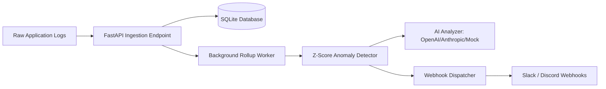
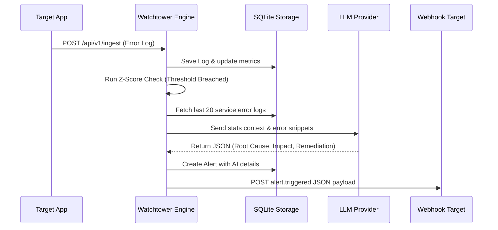
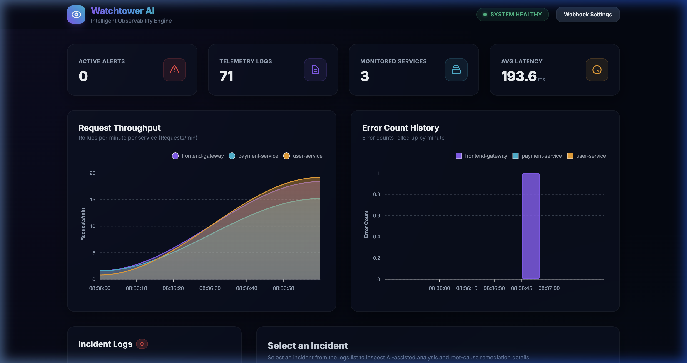
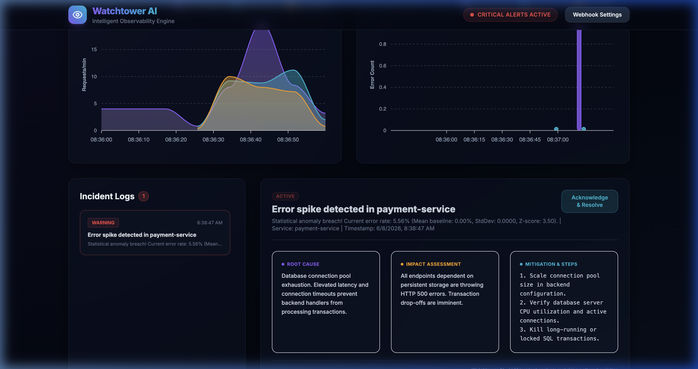

# WatchTower AI
## Intelligent Observability & Event Watchdog

**Author:** Oluwaseun Samuel Ajiboye  
**Tag:** Catalyst  
**Date:** June 2026  

---

## Slide 1: The Problem Statement

### The Observability Overhead
- **Enterprise Bloat**: Traditional monitoring tools (Datadog, Splunk) are expensive, heavy, and require complex agent configurations.
- **Alert Fatigue**: Developers are bombarded with raw alerts without context, leading to slower incident response times.
- **Isolated Root-Cause Search**: When a threshold is breached, SREs must manually scan log files and query stack traces to identify what failed.

### The Solution: Watchtower AI
- A **lightweight, developer-first engine** that runs locally on SQLite and FastAPI.
- Combines **statistical anomaly detection** with **automated LLM incident analysis** to deliver instant root-cause reports via webhooks and a glassmorphic dashboard.

---

## Slide 2: High-Level System Architecture

Watchtower AI operates as a unified observability hub:

- **Unified Stack**: Fronted by FastAPI; stores telemetry logs, rolled-up metrics, alert triggers, and webhook audits in a single local database.
- **Background Worker**: Processes minutely metrics aggregations asynchronously to maintain rapid client response times.

---

## Slide 3: Key Features

### 📡 Low-Latency Ingestion
Accepts raw logs from any service and immediately queues them for metrics extraction.

### 📊 Rolling-Window Z-Score Checks
Calculates standard deviation over moving historical error rate windows. Spikes with a Z-score > 3.0 trigger instant incidents.

### 🤖 Multi-Provider LLM Analyzer
Connects to **OpenAI** or **Anthropic** to extract error patterns, assess user impact, and suggest numbered mitigation steps.

### 🔗 Sandbox Webhook Playground
Includes a local webhook testing receiver that displays alert payloads in real time directly on the UI dashboard.

---

## Slide 4: AI Root-Cause Analysis Workflow

- **Credential Independence**: Gracefully falls back to localized heuristic logic if no API credentials are provided in `.env`.

---

## Slide 5: Technology Stack

Watchtower AI utilizes a modern, zero-config, single-service technology stack:

- **Backend Framework**: **FastAPI** (Python 3.12/3.14) — high performance, fully asynchronous ASGI framework.
- **Storage & ORM**: **SQLite** + **SQLAlchemy 2.0** — zero-setup database with connection safety configurations.
- **AI Integrations**: **OpenAI SDK** & **Anthropic SDK** — with dynamic key detection and model configurability.
- **Frontend Layer**: **Tailwind CSS v3** & **Flowbite Components** — modern dark-mode, glassmorphic layout.
- **Data Visualizations**: **ApexCharts** — real-time timeseries request rates and error tracking charts.
- **Unit Testing**: **pytest** & **pytest-asyncio** — running against in-memory static pool databases.

---

## Slide 6: Visual Dashboard Demo

Our visual verification flows demonstrate the responsive dashboard in action:

- **Real-Time Data**: Polls throughput (requests/min) and errors from the SQLite database.
- **Chaos Controls**: Buttons on the bottom allow developers to inject error spikes instantly.

---

## Slide 7: AI Analysis Detail Pane

When a spike is triggered, the AI details populate instantly:

- **Root Cause**: Identifies the exact failure (e.g. database lockup, gateway timeout).
- **Remediation**: Lists clear, copyable step-by-step mitigation instructions for the SRE.

---

## Slide 8: Lessons Learned

1. **In-Memory Thread Safety**:
   FastAPI's multi-threaded nature requires special database configs for SQLite. Enabling `check_same_thread=False` and using `StaticPool` during test executions prevents transaction conflicts.
2. **Graceful Fallbacks are Critical**:
   Designing detailed heuristic mock analyzers ensures the application remains functional and useful for local testing even when external LLM API credentials are not set.
3. **Pydantic V2 Migration**:
   Keeping up with Pydantic V2 syntax (like `ConfigDict`) rather than legacy V1 `class Config` classes removes deprecation warnings and ensures long-term framework compatibility.

---

## Slide 9: Future Improvements

- **Distributed Log Collectors**: Support log streaming agents like Fluentbit or Vector directly into Watchtower.
- **Advanced Anomaly Models**: Integrate lightweight local Machine Learning models (like Isolation Forest) for statistical baseline modeling.
- **Role-Based Access Control (RBAC)**: Secure dashboard access and webhook registrations.
- **Multi-Service Alert Correlation**: Deduplicate and group related errors across microservices into a single parent incident.

---

## Slide 10: Conclusion

**Watchtower AI** proves that observability does not have to be expensive or complicated. 

By combining:
- A local SQLite database,
- Simple statistical Z-score triggers,
- Configurable AI root-cause analyzers, and
- A stunning Tailwind dashboard...

...we have built a premium, developer-first event watchdog that delivers Datadog-level insights with zero external dependency bloat.

### Thank You!
**Q&A Session Open**
